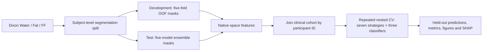

# LEG_MRI: thigh Dixon MRI segmentation and machine learning

Research code for **Automated Multi-Parametric Thigh Dixon MRI for
Quantitative Tissue Phenotyping and OGTT-Defined Early Dysglycemia Risk Stratification**.

The workflow includes DICOM/NIfTI input, three-channel
3D segmentation, held-out masks, native-space quantitative/radiomic features,
seven feature strategies, repeated nested cross-validation, LR/RF/XGBoost,
ROC/calibration/DCA, and held-out SHAP analysis.
DeLong comparisons and OGTT physiological analyses are outside this release.



Read [pipeline instructions](docs/pipeline.md) for the full workflow and
[method reference](docs/methods.md) for algorithms and parameter definitions.
中文说明见 [代码使用说明](docs/usage_zh.md)。

## Install and test

Use a separate Python 3.10–3.12 environment. Full installation:

```bash
python -m venv .venv
# Linux/macOS: source .venv/bin/activate
# PowerShell: .venv\Scripts\Activate.ps1
python -m pip install -e ".[dev,models,imaging,segmentation]" -c constraints.txt
python scripts/install_radiomics.py
pytest -q
leg-mri demo --config configs/study.yaml --output outputs/demo
```

PyRadiomics needs a C compiler; see [installation](docs/installation.md).
For ML from existing feature tables only, install `.[dev,models]` and omit the
radiomics installer; no GPU or MRI libraries are needed for that route.

The `demo` uses **synthetic feature tables** and smaller grids for software testing.
Study settings are in [configs/study.yaml](configs/study.yaml).

## Run from images

Create `subjects.csv` using [the template](examples/subjects.csv):
`Patient_ID,water,fat,ff,manual_mask`. Paths refer to aligned 3D NIfTI volumes;
relative paths are resolved from the CSV's directory. The masks are training and
evaluation references. Label values and scanner FF units are specified in the config.

```bash
leg-mri study-run --subjects data/subjects.csv --clinical data/clinical.csv --config configs/study.yaml --work outputs/study --device cuda
```

This prepares the subject split, plans/preprocesses the images, trains the five
segmentation models, exports OOF and test masks, extracts/combines features, and
runs the ML comparison. To resume at a completed stage boundary, use
`--start-at train`, `predict`, `extract` or `model` with the same configuration.
Existing completed folds are retained; interrupted folds can resume from their
latest checkpoint. Use `--splits data/splits.json` to supply predefined
segmentation allocations. Individual stage commands and DICOM
conversion are documented in [pipeline instructions](docs/pipeline.md).

The small **image-to-ML** software smoke test runs on CPU:

```bash
python scripts/smoke_imaging.py --output outputs/imaging_smoke
```

It uses synthetic volumes and a reduced six-level network. Full-resolution GPU
training is configured separately in `configs/study.yaml`.

## Input tables for machine learning

Supply CSV or XLSX files, with one row per participant and a shared `Patient_ID`.
Use pseudonymous IDs; do not include identifiers or private data in the repository.

| Table | Required contents |
|---|---|
| Clinical | `Patient_ID,Diabetes_Status,Age,Sex,BMI` |
| Quantitative | `Patient_ID` and the 14 quantitative features listed below |
| Radiomics | `Patient_ID` and named columns such as `IMAT_Fat_original_firstorder_90Percentile` |

`Diabetes_Status`: 0=normal, 1=dysglycemia. Sex must have a documented and consistent
0/1 encoding. Clinical data can contain other laboratory columns; these are not
passed to the predictors. Imaging tables can include the seven segmentation-only
participants; modeling keeps the IDs in the supplied clinical cohort and does not
silently drop a clinical participant with a missing imaging record.

The default quantitative panel follows Supplementary Table S6:

```text
IMAT_to_Muscle, Subcutaneous_to_Muscle, IMAT_to_IMAT_Muscle,
Muscle_to_SoftTissue, Fat_to_SoftTissue, IMAT_to_SoftTissue,
SubFat_to_SoftTissue, Fat_to_Muscle, SMFF_mean, SMFF_std,
SMFF_median, SMFF_25perc, SMFF_75perc, SMFF_wf
```

Aliases `IMAT_to_（IMAT+Muscle）` and `IMAT_to_(IMAT+Muscle)` are mapped automatically.
Additional aliases can be declared in `feature_aliases`. To use a different
quantitative panel, explicitly supply `quantitative_features: [column1, ...]`.
Radiomics columns contain `_original_`; diagnostic columns are excluded.
Examples contain twelve synthetic records for schema illustration; use the
80-participant `demo` for an executable smoke test.

## Run machine learning from existing tables

```bash
leg-mri model-cv --clinical data/clinical.csv --quantitative data/quantitative.csv --radiomics data/radiomics.csv --config configs/study.yaml --output outputs/study
```

The default run evaluates all 21 combinations of these strategies and LR/RF/XGBoost:

| Configuration name | Features |
|---|---|
| `Clinical_Only` | Age, Sex, BMI |
| `Quantitative_Only` | Selected quantitative features |
| `Radiomics_Only` | Selected radiomics |
| `Image_Only` | Integrated quantitative + radiomics |
| `Quantitative_Clinical` | Selected quantitative + clinical |
| `Radiomics_Clinical` | Selected radiomics + clinical |
| `Image_Clinical` | Integrated quantitative + radiomics + clinical |

All strategies use identical outer splits: **5 folds × 2 repetitions**. Inner CV
also uses 5×2. Within every inner training partition the pipeline fits imputation,
correlation pruning, texture-retention stability, scaling and L1 logistic selection.
Clinical covariates are retained. The integrated imaging strategy derives stable
per-domain candidates in additional training-only subfolds (frequency **>80%**),
then re-prunes and L1-selects the combined pool. If no imaging feature survives,
the fold is retained with an intercept-only predictor or the clinical covariates.

The full grids can take considerable CPU time. `cv.n_jobs` controls parallel search;
individual RF/XGBoost fits use one thread to avoid nested oversubscription. The
temporary `outputs/.../_cache` reuses identical selector fits across grid candidates.
Use a new output directory for each run.

### Outputs

- `outer_splits.json`: training/test IDs for every repeat and fold.
- `outer_predictions.csv`: every held-out probability, participant, repeat and fold.
- `participant_predictions.csv`: mean held-out probability per participant.
- `performance.csv`: AUC, accuracy, sensitivity, specificity, Brier and bootstrap CIs.
- `fold_metrics.csv`, `inner_auc_summary.csv`: fold performance and inner tuning summaries.
- `selected_features.csv`, `selection_stability.csv`: selected predictors and frequencies.
- `heldout_shap.csv`, `shap_importance.csv`, `figures/`: held-out explanation values and plots.
- `fold_models/`: fitted preprocessing/model pipelines, chosen parameters and training IDs.
- `run.json`: resolved settings, input hashes and installed package versions.

Performance CIs resample participants after averaging repeated predictions, so
the two observations per person are not counted as independent samples. The
classification threshold is 0.5, configurable before analysis. Inner AUC is a
tuning score; it is not an independent validation estimate. SHAP uses outer-test
rows and training-only backgrounds. SHAP scales are recorded (RF: probability;
LR/XGBoost: log odds). Zero contributions from folds where a feature was not
selected are included in the global mean-absolute-SHAP denominator.

## Refit and predict

After model comparison, explicitly choose the strategy and classifier to refit:

```bash
leg-mri model-fit --clinical data/clinical.csv --quantitative data/quantitative.csv --radiomics data/radiomics.csv --config configs/study.yaml --strategy Image_Clinical --model RF --output outputs/final_model
leg-mri model-predict outputs/final_model data/new_subject_features.csv --output outputs/predictions.csv
```

The prediction table includes `Patient_ID` and the required feature columns.
All imputation, scaling and selection are restored from the saved pipeline.
Load only trusted `.joblib` files. Refit produces a deployable research model,
not a new independent performance estimate.

## Documentation and data

See [pipeline instructions](docs/pipeline.md), [methods](docs/methods.md),
[installation](docs/installation.md) and [software tests](docs/validation.md).
This repository distributes code, configuration, tests and synthetic examples.
Participant images, clinical records and trained weights are not included.
